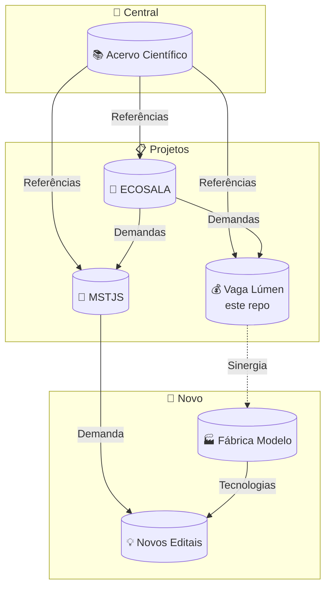

# 💰 Vaga Lúmen — Proposta FINEP Mais Inovação

> 🌿 **Bem Viver** — Somos um encontro de trajetórias diversas que convergem em um propósito comum: a construção de mundos onde a vida, em todas as suas formas, ocupe o centro das relações sociais, econômicas e políticas.
>
> Não há aqui uma única disciplina, uma única origem ou uma única voz. Somos agrônomos, arquitetos, microbiologistas, engenheiros, educadoras, nutricionistas, psicólogas, gestoras comunitárias, desenvolvedores e pesquisadores autodidatas. Atuamos em institutos federais, centros de pesquisa, universidades, assentamentos da reforma agrária, Áreas de Proteção Ambiental e periferias urbanas.
>
> O que nos une não é um título, mas uma convicção: a de que a ciência deve servir à terra e aos povos que nela habitam. Trabalhamos com agroecologia e bioconstrução, com bambu e poliuretano vegetal, com saneamento ecológico e bioeconomia regenerativa, com tecnologias sociais que emergem do chão das comunidades e retornam a elas como autonomia.
>
> Este repositório é parte desse ecossistema — a **proposta de captação** que transforma conhecimento científico acumulado em projeto estruturado para editais de fomento. Aqui cada referência é rastreável, cada TRL é honesto, cada linha foi pensada coletivamente.
>
> Seja bem-vinda, bem-vindo. Há lugar para quem chega com vontade de aprender, contribuir e transformar.

## 🧭 O que é este repositório?

Aqui fica a **proposta completa** para o edital **FINEP Mais Inovação — Rodada 2**
(Economia Circular e Cidades Sustentáveis), modalidade Subvenção Econômica.

**Projeto:** Vaga Lúmen — Laboratório Itinerante de Permacultura, Saneamento Descentralizado
e Moradia Modular Sustentável.

**👥 Pra quem?** Grupo ECOSALA, avaliadores FINEP, parceiros institucionais.



---

## 📂 O que tem aqui

| Arquivo | O que é | Acessar |
|---|---|---|
| `proposta-final-vaga-lumen.md` | **Proposta pronta para submissão** (com limites de caracteres) | [📄 abrir](https://github.com/takwaratec/fundo-vaga-lumen-2026/blob/main/proposta-final-vaga-lumen.md) |
| `regulamento-finep-mais-inovacao.md` | Regulamento oficial convertido para .md | [📄 abrir](https://github.com/takwaratec/fundo-vaga-lumen-2026/blob/main/regulamento-finep-mais-inovacao.md) |
| `plano-correcao-regulamento.md` | O que falta para a proposta ficar dentro do regulamento | [📄 abrir](https://github.com/takwaratec/fundo-vaga-lumen-2026/blob/main/plano-correcao-regulamento.md) |
| `reavaliacao-trl-evidencias.md` | TRL de cada tecnologia com artigos científicos (DOIs) | [📄 abrir](https://github.com/takwaratec/fundo-vaga-lumen-2026/blob/main/reavaliacao-trl-evidencias.md) |
| `compositos-alternativos-embarcacao.md` | Técnicas para construir a embarcação (bombonas, rabetas, solar) | [📄 abrir](https://github.com/takwaratec/fundo-vaga-lumen-2026/blob/main/compositos-alternativos-embarcacao.md) |
| `analise-lacunas-honesta.md` | TRL real de cada subsistema (sem inflar) | [📄 abrir](https://github.com/takwaratec/fundo-vaga-lumen-2026/blob/main/analise-lacunas-honesta.md) |
| `bibliografia-abnt.md` | Todas as referências em formato ABNT | [📄 abrir](https://github.com/takwaratec/fundo-vaga-lumen-2026/blob/main/bibliografia-abnt.md) |
| `curatoria-imagens-andre.md` | Análise das imagens de André Blanco | [📄 abrir](https://github.com/takwaratec/fundo-vaga-lumen-2026/blob/main/curatoria-imagens-andre.md) |
| `referencias-cientificas.md` | Artigos científicos sobre captação de água | [📄 abrir](https://github.com/takwaratec/fundo-vaga-lumen-2026/blob/main/referencias-cientificas.md) |
| `relatorio-alteracoes.md` | Histórico de mudanças do projeto | [📄 abrir](https://github.com/takwaratec/fundo-vaga-lumen-2026/blob/main/relatorio-alteracoes.md) |
| `docs/projeto-vaga-lumen-andre-blanco.md` | Projeto original de André Blanco (convertido de .docx) | [📄 abrir](https://github.com/takwaratec/fundo-vaga-lumen-2026/blob/main/docs/projeto-vaga-lumen-andre-blanco.md) |
| `docs/proposta-financiadores-andre-blanco.md` | Proposta para financiadores por André Blanco (convertido de .docx) | [📄 abrir](https://github.com/takwaratec/fundo-vaga-lumen-2026/blob/main/docs/proposta-financiadores-andre-blanco.md) |

> 📄 = abre no navegador pelo GitHub

---

## 📋 Allinhamentos Recentes (26/06/2026)

**Decupagem de áudios André Blanco → Fabio Takwara:**

| Tema | Encaminhamento |
|---|---|
| **Proponente** | Fundação Embrapa ou FUNCAMP como gestora financeira — reunião com Daniela agendada |
| **Territórios** | Mário Lago + Mário Covas + APAs da região (LAB-APA) + CDHU |
| **Escopo adicional** | Incluir Ecosala Móvel (carretas), bioconstrução bambu, fábrica-escola |
| **Fábrica Modelo** | Maurílio tem contato na FINEP — oficinas de projeto na próxima semana |
| **Equipamentos** | André citou projeto Embrapa como ilustração — Fabio ponderou: precisa definir cliente específico (assentamentos, Labiapa, Fábrica Modelo) |
| **Tecnologias Fabio** | Biorrefinaria, forno cascateamento, painéis PU+bambu, conexões geodésicas |
| **Correções** | Referências UnB/LaPeCFaS removidas; Imperveg referenciada |

> 📄 Detalhes completos: [`docs/editais/decupagem-audios-andre-vaga-lumen.md`](docs/editais/decupagem-audios-andre-vaga-lumen.md)

---

## 📚 Acervo científico

Pesquisas, fichas técnicas e referenciais para embasar novos projetos:
👉 **https://takwaratec.github.io/Analises-e-escrita-cientifica/**

### Fichas individuais dos membros ECOSALA
[github.com/takwaratec/Analises-e-escrita-cientifica/tree/main/docs/analyses/ecosala](https://github.com/takwaratec/Analises-e-escrita-cientifica/tree/main/docs/analyses/ecosala)

### Acervo de Pesquisa (protocolos abertos, ensaios, Diquada)
[github.com/takwaratec/Mulheres-Tecem-Amazonia](https://github.com/takwaratec/Mulheres-Tecem-Amazonia)

---

## 📋 Check-list de submissão

- [ ] **Empresa proponente definida** (CNPJ) — ⬜ Pendente
- [ ] **Contrapartida calculada** — ⬜ Pendente
- [ ] **Orçamento >= R$ 5.000.000** — ⬜ Pendente (atual: R$ 3.816.000)
- [ ] **TRL de partida >= 3** — ✅ OK (reavaliado com evidências)
- [ ] **Cartas de anuência das ICTs** — ⬜ Pendente
- [ ] **Cartas de anuência dos territórios** — ⬜ Pendente
- [ ] **Anexo 3 — Declaração de ações coletivas** — ⬜ Pendente
- [ ] **Anexo 4 — Declaração ambiental** — ⬜ Pendente
- [ ] **Anexo 5 — Metodologia TRL** — ⬜ Pendente
- [ ] **Vídeo de 5 minutos** — ⬜ Pendente

---

## 📚 Produção científica dos membros — como contribuir

As fichas individuais no repositório de análises científicas foram atualizadas com base em busca exaustiva em bases indexadas (CrossRef, Google Scholar, Lattes).

**Para membros com produção acadêmica encontrada:** Marcos Paron (1 artigo + 2 teses + Lattes confirmado), Gisele Vilela (2 artigos com DOI), Vicente Borges (tecnologias sociais MPTDF) e Raphaela Palma (dissertação USP).

**Para membros sem produção acadêmica em bases indexadas:** André Blanco, Joaquim Sando, Luci Okino, Murillo Miguel, Henrique Bueno e Luis Felipe — a busca em CrossRef, Google Scholar e ResearchGate não retornou artigos com DOI associados ao nome.

> 👉 **Caso você tenha artigos, teses, capítulos ou trabalhos publicados que não foram encontrados, abra uma Issue neste repositório ou envie o link do seu Lattes/ORCID para Fabio Takwara.** As fichas serão atualizadas com a produção fornecida.

---

## 🤖 Sobre este repositório

- **Foco:** Exclusivo para a proposta FINEP
- **Público:** Avaliadores, financiadores e equipe técnica
- **Atualização:** README atualizado sempre que um novo documento é adicionado ou o check-list muda

## 🔗 Repositórios irmãos

- **ECOSALA** (coletivo): [github.com/takwaratec/ECOSALA](https://github.com/takwaratec/ECOSALA)
- **Juventude Solidária** (MST): [github.com/takwaratec/plataforma-juventude-solidaria-2026](https://github.com/takwaratec/plataforma-juventude-solidaria-2026)


---

## 📲 Como baixar este repositório

### No computador (Windows/Mac/Linux)

**Opção 1 — Baixar ZIP (mais fácil)**
1. Acesse `https://github.com/takwaratec/fundo-vaga-lumen-2026`
2. Clique no botão verde **"Code"**
3. Selecione **"Download ZIP"**
4. Extraia a pasta no seu computador

**Opção 2 — Clonar com Git (para quem usa Git)**
Abra o terminal e digite:
```bash
git clone https://github.com/takwaratec/fundo-vaga-lumen-2026.git
```

### No celular (app GitHub)

1. Instale o app **GitHub** (iOS/Android)
2. Faça login ou crie uma conta gratuita
3. Toque no ícone de busca 🔍 e digite: `takwaratec/fundo-vaga-lumen-2026`
4. Toque no nome do repositório
5. Toque no botão **"Code"** (ou **"Clone"**)
6. Selecione **"Download ZIP"** para baixar
7. Os arquivos .md abrem direto no app

> 💡 **Dica:** Arquivos .md (Markdown) abrem formatados no GitHub automaticamente. No celular, use o app GitHub para visualizar.
